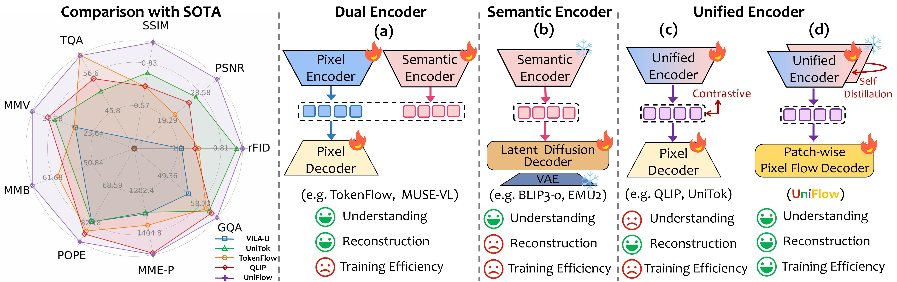

<div align="center">
<h1>⚡ UniFlow: A Unified Pixel Flow Tokenizer for Visual Understanding and Generation</h1>

[]()
[](https://github.com/ZhengrongYue/UniFlow)
[](https://huggingface.co/yuezhengrong/UniFlow)

</div>

This project presents **UniFlow** (Unified Pixel Flow Tokenizer), a unified continuous visual tokenizer that eliminates the conflict between semantic understanding and high-fidelity reconstruction. By marrying a pretrained vision encoder with a patch-wise flow decoder, UniFlow delivers state-of-the-art reconstruction and multimodal understanding via a single encoder tokenizer, while surpassing both discrete and continuous counterparts. <br><br>


<p align="center">
  
  <br>
  <em>
  Comparison of different training paradigms for unified tokenizers. UniFlow achieves a new state-of-the-art in reconstruction fidelity and multimodal understanding, surpassing both discrete and continuous unified tokenizers, while offering high compression ratios. (All multimodal large language models are trained on LLaVA-v1.5 data with Vicuna-7B, except that TokenFlow uses Vicuna-13B.)</em>
</p>


<p align="center">
  
  <br>
  <em>Various downstream tasks demonstrate UniFlow's robust visual representation.</em>
</p>

## 🔥 Updates

* **[2025.08.08]** 🚀 🚀 🚀 We are excited to release **UniFlow**, a powerful unified tokenizer featuring our novel **Layer-wise Adaptative Distillation** and a **Patch-wise Pixel Flow Decoder**. Code and pretrained models are now available!

## 📖 Quick Start

### Inference

Simply test the effect of each model reconstruction:
```
bash quick_start.ipynb
```


## ❤️ Acknowledgement
Our work builds upon the foundations laid by many excellent projects in the field. We would like to thank the authors of [MAR](https://github.com/LTH14/mar). We also drew inspiration from the methodologies presented in [FlowMo](https://github.com/kylesargent/FlowMo/), [InternVideo2](https://github.com/OpenGVLab/InternVideo/tree/main). We are grateful for their contributions to the community.


